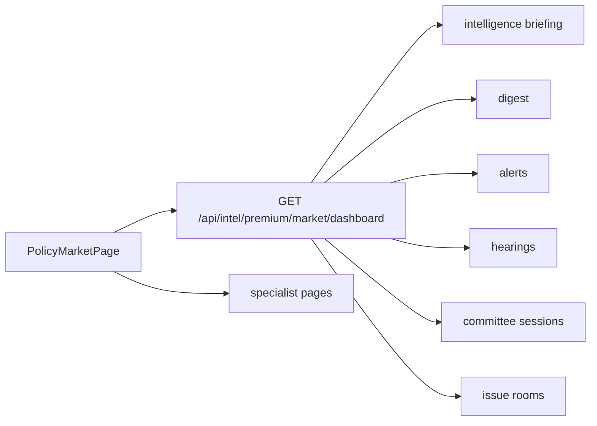

# Policy Market Implementation Pass

Date: 2026-04-06

## Objective

Deliver the first serious implementation pass for the flagship `Policy Market` screen using existing backend capabilities wherever possible.

This pass should make `/market` feel like the main operator surface for:

- committee and hearing focus
- digest and alert pressure
- issue-room escalation
- intelligence briefing
- next actions

## Guiding Principles

### 1. Keep the flagship as an aggregate read model

The current `PolicyMarketPage` already benefits from a single aggregate endpoint:

- `GET /api/intel/premium/market/dashboard`

Continue this pattern for the next pass.

Preferred rule:

- expand the market dashboard payload
- avoid turning the page into many ad hoc request calls

This keeps the flagship fast, coherent, and easier to evolve.

### 2. Reuse specialist systems instead of rebuilding them

Use existing systems as sources of truth:

- committee intelligence
- hearings
- digest
- alerts
- issue rooms
- intelligence briefing

The market page should summarize and route operators into those deeper surfaces, not duplicate all editing logic.

### 3. Favor workflow clarity over feature count

The next pass should make one path obvious:

`hearing or committee signal -> why it matters -> operator action -> client-ready output`

## Implementation Scope

### In scope for this pass

- direct committee and hearing emphasis
- direct intelligence briefing section
- direct alert pressure module
- stronger issue-room actionability
- stronger evidence and committee follow-up cues
- one clear Business & Commerce preset

### Out of scope for this pass

- full subscription or billing system
- broad auth redesign
- deep relationship-model correctness work
- full committee entity-resolution overhaul
- complete inline mutations for every action

## Recommended Delivery Shape

## Proposed Backend Changes

Primary file:

- `server/policy-intel/routes.ts`

Primary goal:

- extend `GET /api/intel/premium/market/dashboard`

### Add to aggregated payload

#### 1. Intelligence briefing

Pull in:

- `GET /api/intel/intelligence/briefing`

Recommended shape in market payload:

- `briefing.headlines`
- `briefing.priorityInsights`
- `briefing.topRisks`
- `briefing.generatedAt`

#### 2. High-signal alerts

Pull in:

- `GET /api/intel/alerts`

Recommended market payload shape:

- top pending review alerts
- top high-score alerts
- recent alert movements tied to watchlists or issue rooms

Suggested cap:

- 5 to 8 alerts

#### 3. Hearings

Pull in:

- `GET /api/intel/hearings/this-week` or `GET /api/intel/hearings`

Recommended market payload shape:

- upcoming hearings
- recently updated hearings
- direct links to committee sessions when available

#### 4. Business & Commerce preset metadata

Add a lightweight preset object if a matching session or hearing exists.

Recommended shape:

- `featuredPreset.id`
- `featuredPreset.label`
- `featuredPreset.kind`
- `featuredPreset.sessionId`
- `featuredPreset.hearingId`

## Proposed Frontend Changes

Primary files:

- `client-policy-intel/src/pages/PolicyMarketPage.tsx`
- `client-policy-intel/src/api.ts`

### 1. Expand market dashboard types

Update `MarketDashboard` in `client-policy-intel/src/api.ts` to include:

- `briefing`
- `alerts`
- `hearings`
- `featuredPreset`

### 2. Add a top control strip

Do not build the full final top bar yet.

For this pass, add:

- featured preset button
- simple focus mode toggle
- refresh action

The goal is to reduce ambiguity without overbuilding controls.

### 3. Make committee and hearing focus unmistakable

Add a featured committee/hearing module above or beside the existing focus panel.

The module should show:

- committee name
- hearing date and status
- live summary or latest summary
- focus topics
- top follow-up actions
- links to recap and focused brief workflows

### 4. Add an operator briefing module

Render a visible market briefing block sourced from the intelligence briefing payload.

This should answer:

- what matters now
- why now
- what to do before the next window

### 5. Add a direct alert pressure panel

Surface high-signal alerts directly on `/market` instead of only through digest counts.

Show:

- score
- title
- why it matters
- watchlist or issue-room context

### 6. Strengthen issue-room actionability

Enrich the selected issue-room state with:

- recommended path
- linked alert count
- open task count if available
- direct output actions

If open task count is not currently in the aggregate payload, defer it rather than adding a large backend expansion in this pass.

## File-Level Work Order

### Step 1. Extend aggregate payload

Files:

- `server/policy-intel/routes.ts`
- `client-policy-intel/src/api.ts`

Deliverable:

- market payload includes briefing, alerts, hearings, and featured preset data

### Step 2. Update flagship UI composition

Files:

- `client-policy-intel/src/pages/PolicyMarketPage.tsx`

Deliverable:

- visible direct modules for briefing, alert pressure, and hearing emphasis

### Step 3. Tighten committee workflow cues

Files:

- `client-policy-intel/src/pages/PolicyMarketPage.tsx`

Deliverable:

- clearer committee-war-room orientation from the flagship page

### Step 4. Validate with live data

Validation targets:

- `/market` loads without regressions
- empty states still work
- Business & Commerce preset resolves if live data exists
- page still works when premium relationship or session data is unavailable

## Success Criteria

This pass is successful if a user can open `/market` and immediately understand:

1. what committee or issue is moving
2. why it is moving
3. what the next operator action should be
4. where to jump for deeper execution

## Deferred Follow-Up

After this pass, the next hardening phase should focus on:

- committee entity resolution and speaker matching
- evidence drill-down from summary to segment
- inline actions from the flagship
- nav simplification around the golden path
